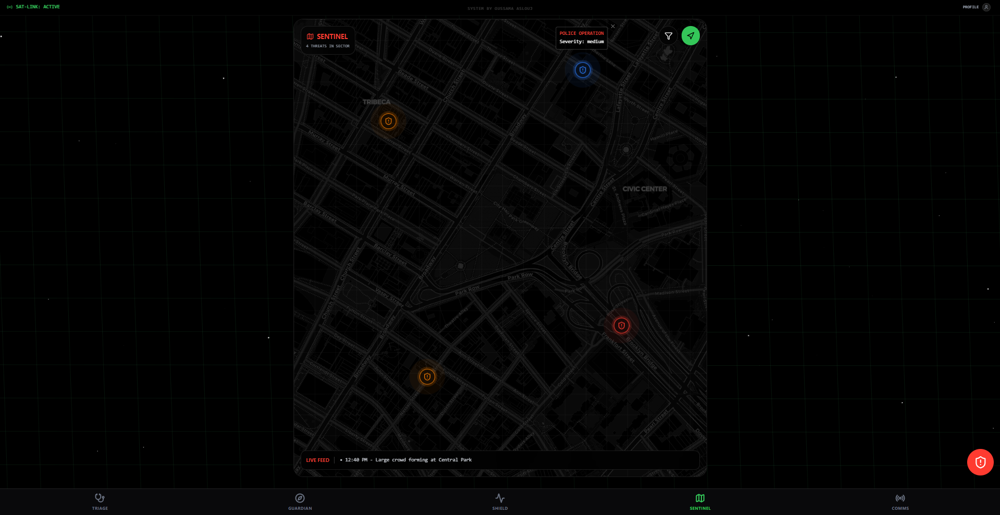
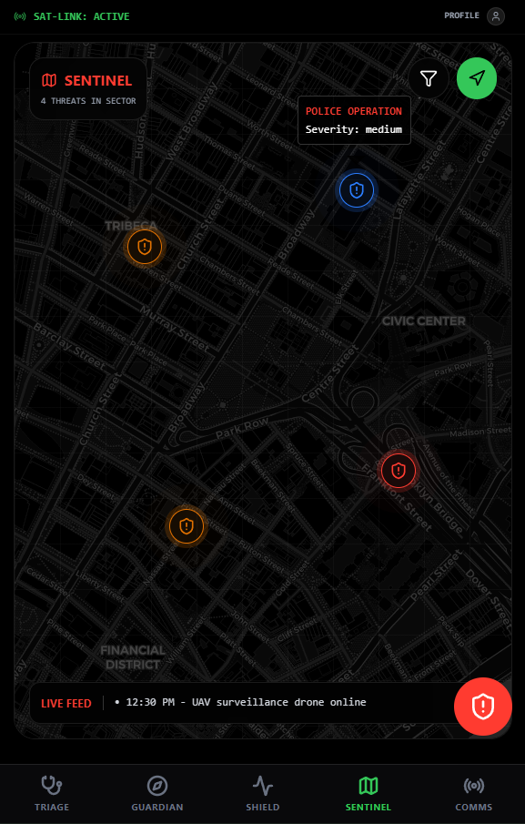
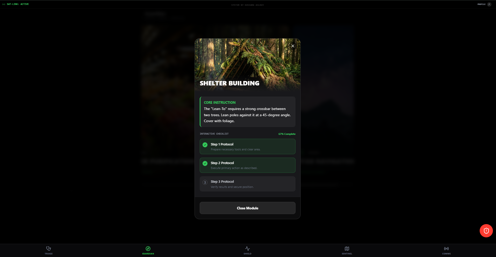
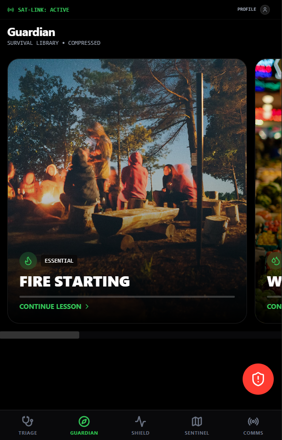
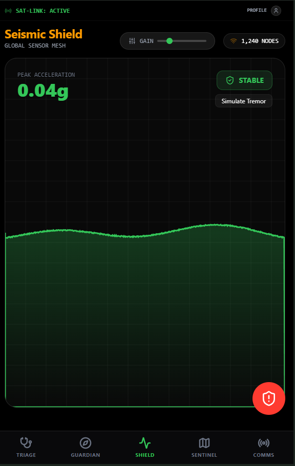
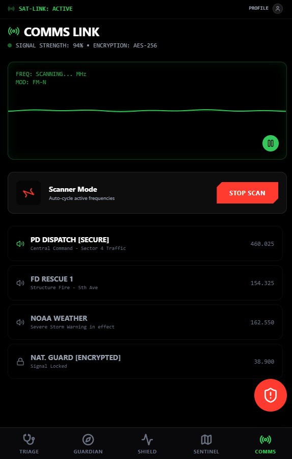

# Emerge Plus: Enhanced Emergency Response System

> **Author / Developer**: Oussama Aslouj

Emerge Plus is a next-generation, tactical survival and emergency response interface designed for resilience in high-stakes environments. It bridges the gap between digital intelligence and physical survival, providing users with critical tools when traditional infrastructure fails.

---

## ⚠️ Status: In Active Development (WIP)
While the core systems — **Sentinel, Guardian, Shield, and Triage** — are functional and interactive, this project is **still in the making**. We are actively refining the user experience, optimizing performance, and building out the truly offline capabilities that define our vision.

> **Note**: You may encounter placeholder data or simulated events as we finalize the backend integrations.

---

## The Problem
In modern disasters — be it natural calamities, civil unrest, or infrastructure collapse — reliance on cloud-based services is a fatal weakness. When the grid goes down:
1.  **Information Vacuum**: GPS fails, news feeds stop, and communication towers become overloaded.
2.  **Medical Isolation**: Access to doctors becomes impossible, leaving individuals to handle injuries without guidance.
3.  **Panic**: Lack of situational awareness leads to poor decision-making.

Current "survival apps" are often static PDFs or require an internet connection to function effectively. There is **no cohesive tactical OS** for the civilian user that combines situational awareness with medical intelligence in an offline-first package.

---

## The Solution: Emerge Plus
Emerge Plus is designed as a **Sat-Link capable, offline-first Tactical OS**. It turns a standard device into a survival multi-tool.

### Core Modules

#### 1. 🛡️ SENTINEL (Tactical Map & Threat Tracking)
*Currently Operational*
> Desktop View:
> 

> Mobile View:
> 

- **Real-Time Intel**: An interactive, dark-mode map (powered by Leaflet & CartoDB tiles) tracking local threats such as civil unrest, fires, or active shooters.
- **Geospatial Tracking**: Migrated from static grids to real geospatial coordinates for precise location tracking.
- **HUD Interface**: A "fighter jet" style Heads-Up Display showing threat severity (Critical/High/Medium) with pulsing indicators.

#### 2. 🧭 GUARDIAN (Survival Library)
*Currently Operational*
> Desktop View:
> 

> Mobile View:
> 

- **Visual Learning**: High-fidelity, locally stored imagery (e.g., Shelter Building, Water Purification) guides users through complex survival tasks.
- **Interactive Checklists**: Step-by-step interactive protocols that track your completion progress.
- **Compressed Knowledge**: Essential survival data is stored locally, ensuring access even without a signal.

#### 3. 🩺 TRIAGE (AI Trauma Doctor)
*Currently Operational (Simulation)*
> Mobile View:
> 

- **Chat Interface**: A specialized medical chatbot designed to assist with triage and first aid.
- **Computer Vision (Simulated)**: A "Vision" mode intended to analyze injuries via camera feed (currently in UI implementation phase).
- **Offline-Ready Design**: Built to function without reaching out to cloud APIs in the future version.

#### 4. ⚡ SHIELD (Seismic & Environmental Monitor)
*Currently Operational*
> Mobile View:
> 

- **Sensor Mesh**: Visualizes seismic activity using a high-performance Canvas rendering engine.
- **Real-Time Alerts**: Detects P-Wave signatures and provides "Time to Impact" warnings.
- **Hardware Integration**: Connects to on-device accelerometers (simulated on desktop) to detect vibrations and tremors.

#### 5. 📡 COMMS (Emergency Broadcast & Signal)
*Currently Operational*
> Mobile View:
> 

- **Emergency Frequencies**: Simulated tuning to emergency broadcast channels (Police, Fire, NOAA).
- **Signal Analysis**: Audio waveform visualization of incoming signals.

---

## 🚀 The Future: Neural Edge AI (DistilBERT)
The most critical upcoming feature is the integration of **True Offline AI**.

### Problem with Current AI
Most AI assistants (ChatGPT, Claude) require an internet connection. In a disaster, they are useless.

### Our Solution: On-Device Small Language Models (SLMs)
We are actively working on implementing **DistilBERT** (a distilled, lightweight version of BERT) and quantized Llama models directly into the browser/app via **WebLLM and WebGPU**.

**How it will work:**
1.  **Zero-Latency Triage**: The AI will run *locally* on your phone's NPU/GPU. It will be able to answer medical questions, guide CPR, or identify edible plants without sending a single byte of data to the internet.
2.  **Edge Compute**: By using DistilBERT, we ensure the model is light enough to run on mobile hardware while being smart enough to understand natural language queries about survival.
3.  **No Signal Required**: Once the app is installed, the brain is in your pocket. Forever.

---

## Technical Stack
- **Framework**: React 19 + TypeScript + Vite (Hyper-fast build tool)
- **UI/UX**: TailwindCSS v4 + Framer Motion (Cinema-grade animations)
- **Mapping**: Leaflet + React-Leaflet + CartoDB Dark Matter
- **Icons**: Lucide React
- **State**: React Context API

---

*System by Oussama Aslouj*
